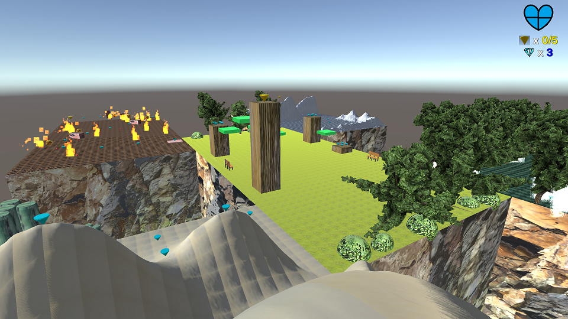

# 3D Collectathon

This is a game created in Unity where the player has to collect 5 Mega Gems scattered across the area. The Mega Gems can be gotten by solving puzzles or clearing platforming challenges. The player is free to explore the 5 open terrains in first person and collect Mini Gems along the way. The player is scored at the end based on their time and Mini Gem count. The game is inspired by my love of 3D platformers and collectathons from the 90s and 2000s. It is designed to be an interactive, imaginative, and immersive virtual world. Models were created using Blender and techniques like model management and baked lighting are used to deliver a smooth experience. Plenty of scripting and particle effects are used to give objects intelligent behavior and make the world come to life.

## Controls

**WASD/↑←↓→:** Move

**Mouse:** Look Around

**Left Shift:** Sprint

**Space:** Jump/Double Jump

**P:** Pause/Resume

## How to Play

You can try out the game on your browser [here](https://abhiek187.github.io/3d-collectathon/WebGL), or you can [clone](https://github.com/Abhiek187/3d-collectathon.git) the game and run it locally on Unity. **Note:** you can only play on a desktop browser (no mobiles) that supports WebGL. Firefox is recommended, but most browsers should be able to run the game.

## Credits

Audio: [freesound.org](https://freesound.org/)

Textures: [freestocktextures.com](https://freestocktextures.com/)
